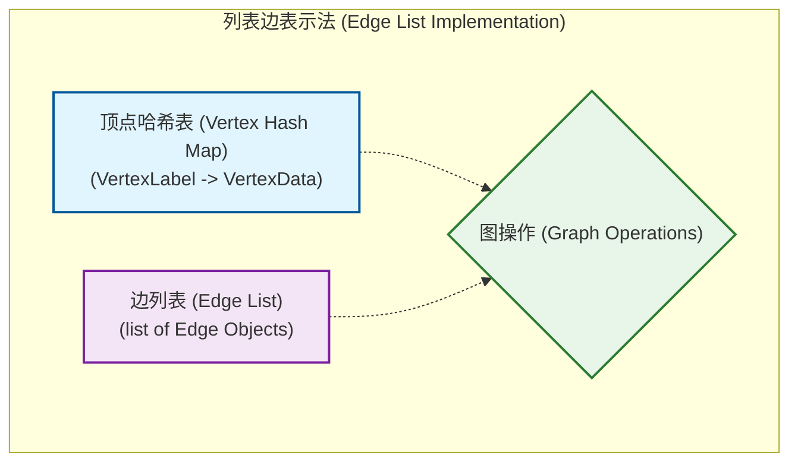
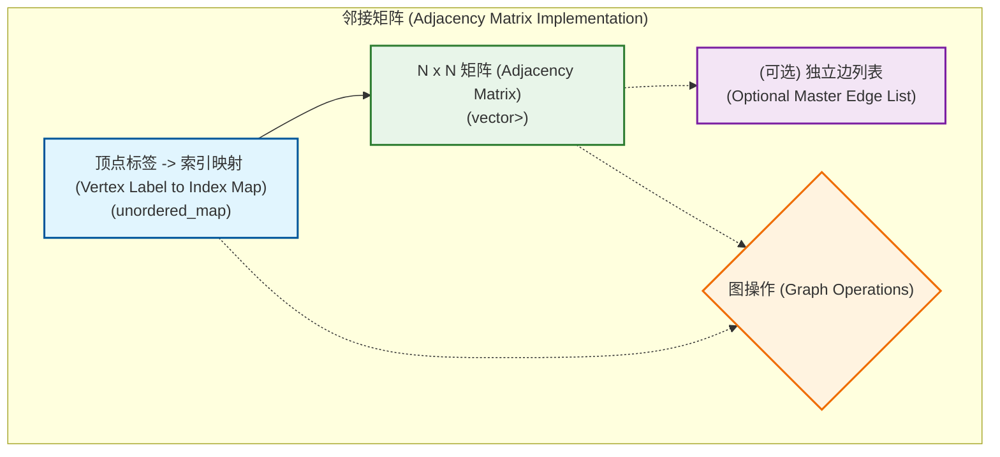
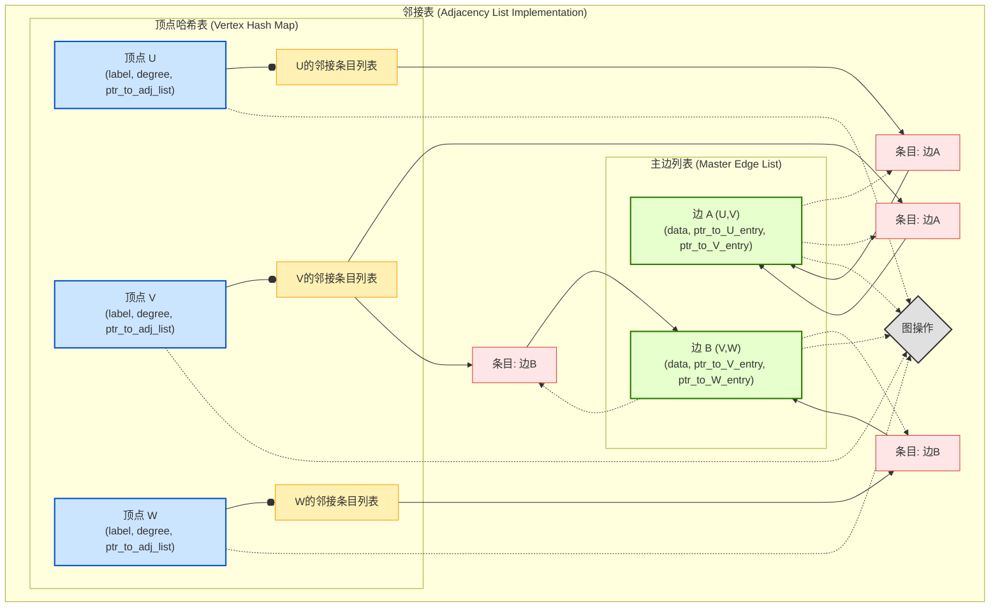
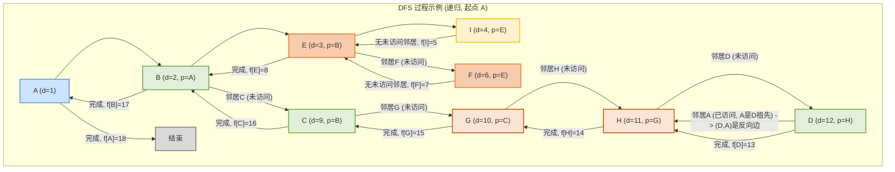
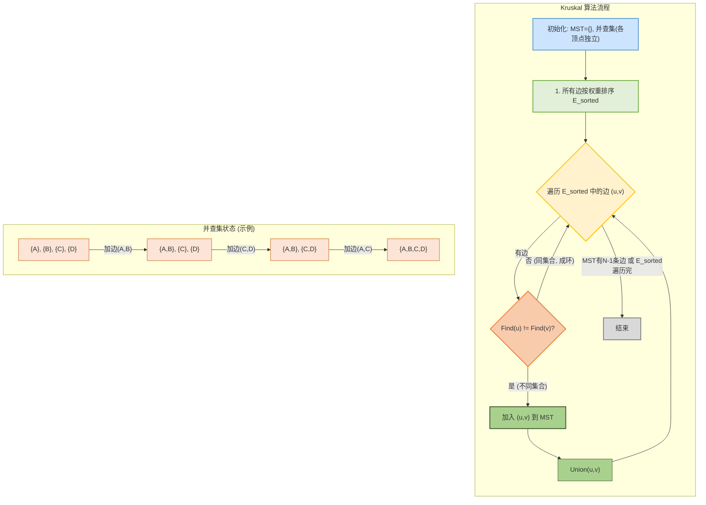
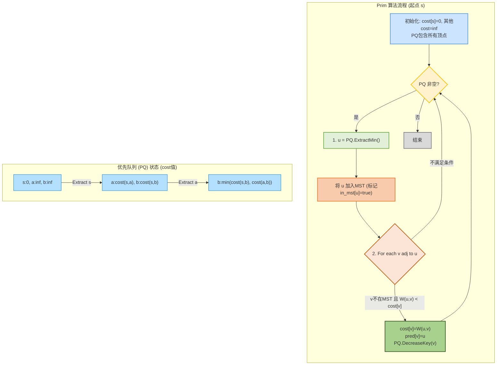

#CS225 


## I. 图的实现 (Graph Implementations)

### I.A. 引言 (Introduction to Graph Implementations)

图 (Graph) 作为一种基础且强大的数据结构，在计算机科学中无处不在，一个图 $G$ 通常定义为一个序偶 $(V, E)$，其中 $V$ 是**顶点** (Vertex) 的集合，而 $E$ 是**边** (Edge) 的集合；我们通常用 $N$ (或 $|V|$) 表示顶点的数量，用 $M$ (或 $|E|$) 表示边的数量
  

在实际应用中，我们不仅需要理论上理解图，还需要有效地将其在计算机中表示和存储，以便进行各种操作，选择合适的图实现方式对于算法的效率至关重要，本讲义将探讨几种核心的图实现策略，分析它们的优缺点以及适用场景

  
我们通常希望对图执行以下关键操作：

*   **插入顶点 (Insert Vertex)**: 向图中添加一个新的顶点
*   **删除顶点 (Remove Vertex)**: 从图中移除一个顶点及其所有关联的边
*   **插入边 (Insert Edge)**: 在两个顶点之间添加一条边
*   **删除边 (Remove Edge)**: 从图中移除一条边
*   **检查邻接性 (Check Adjacency)**: 判断两个顶点之间是否存在边
*   **获取关联边 (Get IncidentEdges)**: 找到与特定顶点相连的所有边
*   **获取邻接顶点 (Get Adjacent Vertices)**: 找到与特定顶点直接相连的所有顶点

  
本讲义将重点讨论三种经典的图实现方法：

1.  **列表边表示法 (Edge List)**
2.  **邻接矩阵 (Adjacency Matrix)**
3.  **邻接表 (Adjacency List)**

  
### I.B. 列表边表示法 (Edge List Implementation)

列表边表示法是最直观也是最基础的图实现方式之一

#### I.B.1. 核心思想

其核心思想非常简单：分别维护一个顶点列表和一个边列表

*   **顶点集合 (Vertex Collection)**: 可以是一个简单的列表或数组，为了快速通过顶点标签 (Label) 查找到顶点对象，通常会使用**哈希表 (Hash Map)**，例如 C++ 中的 `std::unordered_map<VertexLabel, VertexData>`

*   **边集合 (Edge Collection)**: 通常是一个边的列表，例如 C++ 中的 `std::list<EdgeObject>`，每个 `EdgeObject` 会存储构成该边的两个顶点（通常是它们的引用、指针或标签）以及边自身可能带有的标签或**权重 (Weight)**

  

#### I.B.2. 数据结构示例

```cpp

// 概念性C++结构

struct Edge {

    Vertex v1, v2; // 指向顶点对象或存储顶点标签

    EdgeLabel label;

    Weight weight;

};

  

class Graph_EdgeList {

public:

    std::unordered_map<VertexLabel, VertexData> vertices;

    std::list<Edge> edges;

    // ... 图操作方法 ...

};

```

  
#### I.B.3. 操作分析


在分析时间复杂度时，我们假设 $N$ 是顶点数，$M$ 是边数


*   **插入顶点 (`insertVertex(label)`)**:

    *   如果使用哈希表存储顶点，并且我们假设用户负责保证标签的唯一性（不重复插入），则插入操作的期望时间复杂度为 $O(1)$

    *   `vmap.insert(label, vertexData)`

  
*   **插入边 (`insertEdge(u, v, label)`)**:

    *   如果只是将新边添加到边列表的末尾，并且假设用户确保顶点 `u` 和 `v` 已存在于图中，且用户负责处理边的唯一性（例如，不重复添加相同的边），则此操作的时间复杂度为 $O(1)$

    *   `edgeList.push_back(newEdge)`

    *   如果需要检查边是否已存在以避免重复（对于简单图），则需要遍历整个边列表，时间复杂度变为 $O(M)$


*   **删除顶点 (`removeVertex(v)`)**:

    *   首先，从顶点哈希表中删除顶点 `v` (期望 $O(1)$)

    *   然后，必须遍历整个边列表，移除所有与 `v` 相关联的边，这个过程的时间复杂度是 $O(M)$

    *   因此，总时间复杂度为 $O(M)$

*   **删除边 (`removeEdge(u, v)`)**:

    *   需要在边列表中找到并移除连接 `u` 和 `v` 的边，这通常需要遍历整个边列表，时间复杂度为 $O(M)$


*   **检查邻接性 (`areAdjacent(u, v)`)**:

    *   需要遍历整个边列表，查找是否存在一条连接顶点 `u` 和 `v` 的边，时间复杂度为 $O(M)$

*   **获取关联边 (`getIncidentEdges(v)`)**:

    *   需要遍历整个边列表，收集所有以顶点 `v` 为一个端点的边，时间复杂度为 $O(M)$

#### I.B.4. 空间复杂度


空间复杂度为 $O(N + M)$，因为需要存储 $N$ 个顶点和 $M$ 条边，这是存储图信息所需的最小空间

#### I.B.5. 优缺点

*   **优点**:

    *   **概念简单 (Conceptually Simple)**: 实现起来非常直接

    *   **空间高效 (Space Efficient for Sparse Graphs)**: 对于边相对较少的**稀疏图 (Sparse Graph)**，这种方法占用的空间几乎是最小的

    *   **易于构建 (Easy to Construct)**: 如果只是批量添加顶点和边，速度很快

    *   **良好的静态表示 (Good Static Representation)**: 如果图构建后不常变动，或者用于从文件加载/存储图数据，这种格式很方便，因为它直接对应图的数学定义

*   **缺点**:

    *   **查询效率低下 (Inefficient Queries)**: 大多数查询操作（如检查邻接性、获取关联边）都需要遍历整个边列表，导致 $O(M)$ 的时间复杂度，对于边较多的图，这会非常慢

    *   **修改效率低下 (Inefficient Modifications)**: 删除顶点或边也通常需要 $O(M)$ 的时间

#### I.B.6. Mermaid 示意图



  

这种最基础的列表边表示法虽然简单，但在大多数实际应用中，由于其查询和修改效率问题，往往不是首选，除非图非常小或者操作非常受限

  
### I.C. 邻接矩阵 (Adjacency Matrix Implementation)


邻接矩阵是另一种经典的图实现方式，它在特定类型的操作上表现优异


#### I.C.1. 核心思想

邻接矩阵使用一个二维数组（矩阵）来表示顶点之间的连接关系，如果图中有 $N$ 个顶点，则该矩阵是一个 $N \times N$ 的方阵

*   对于**无权图 (Unweighted Graph)**，矩阵元素 `matrix[i][j]` 通常是一个布尔值：如果顶点 $i$ 和顶点 $j$ 之间存在边，则为 `true` (或 1)，否则为 `false` (或 0)

*   对于**有权图 (Weighted Graph)**，`matrix[i][j]` 可以存储边的权重，如果不存在边，可以存储一个特殊值（如无穷大或0，取决于具体约定）

*   对于**无向图 (Undirected Graph)**，邻接矩阵是对称的，即 `matrix[i][j] = matrix[j][i]`因此，可以只存储矩阵的一半（例如上三角或下三角）以节省空间

*   对于**有向图 (Directed Graph)**，`matrix[i][j]` 表示存在一条从顶点 $i$ 指向顶点 $j$ 的边，此时矩阵通常不是对称的

  
为了使用整数索引矩阵，通常需要一个辅助数据结构（如哈希表）将顶点标签映射到 $0 \dots N-1$ 的整数索引


#### I.C.2. 数据结构示例

  

```cpp

// 概念性C++结构

class Graph_AdjacencyMatrix {

public:

    std::unordered_map<VertexLabel, int> vertex_to_index;

    std::vector<VertexLabel> index_to_vertex; // 可选，用于反向查找

    std::vector<std::vector<bool>> adj_matrix; // 无权图示例

    // 或者 std::vector<std::vector<WeightType>> adj_matrix_weighted;

    // 或者 std::vector<std::vector<Edge*>> adj_matrix_edge_pointers; (指向独立边列表中的边)

    int num_vertices;

  

    // ... 图操作方法 ...

};

```

在讲义中，教授提到了一种实现，其中矩阵存储指向一个独立边列表（`std::list<EdgeObject>`）中边的指针，这允许在矩阵中存储更丰富的边信息，而不仅仅是存在性或权重

  

#### I.C.3. 操作分析

  

*   **检查邻接性 (`areAdjacent(u, v)`)**:

    *   首先，通过顶点到索引的哈希表将顶点标签 `u` 和 `v` 转换为整数索引 `i` 和 `j` (期望 $O(1)$)

    *   然后，直接访问 `adj_matrix[i][j]`

    *   总时间复杂度为 $O(1)$，这是邻接矩阵最显著的优势

  

*   **插入边 (`insertEdge(u, v, label_or_weight)`)**:

    *   将 `u`, `v` 转换为索引 `i`, `j` (期望 $O(1)$)

    *   设置 `adj_matrix[i][j] = true` (或权重，或边指针)，如果图是无向的，同时设置 `adj_matrix[j][i]`

    *   总时间复杂度为 $O(1)$

  

*   **删除边 (`removeEdge(u, v)`)**:

    *   将 `u`, `v` 转换为索引 `i`, `j` (期望 $O(1)$)

    *   设置 `adj_matrix[i][j] = false` (或特殊值)，如果图是无向的，同时设置 `adj_matrix[j][i]`

    *   总时间复杂度为 $O(1)$

  

*   **插入顶点 (`insertVertex(label)`)**:

    *   为新顶点分配一个新的索引

    *   这通常意味着需要扩展邻接矩阵的大小，例如从 $N \times N$ 变为 $(N+1) \times (N+1)$这涉及到重新分配内存并复制原有数据，或者如果使用 `std::vector<std::vector<T>>`，则需要添加新的行和列

    *   添加一行和一列的时间复杂度为 $O(N)$（需要初始化新的 $N$ 个元素和已有的 $N$ 行中各添加一个元素）

    *   如果矩阵大小固定后不能动态扩展，则此操作可能不被支持或非常昂贵，讲义中提到，如果通过加倍等策略进行摊销，列的扩展可以摊销，但仍需 $O(N)$ 工作来写入新行/列的值

  

*   **删除顶点 (`removeVertex(v)`)**:

    *   将顶点 `v` 转换为索引 `i`

    *   一种简单的方法是将该行和该列标记为“未使用”或“已删除”（例如，使用哨兵值或一个单独的布尔数组来跟踪活动顶点），这本身是 $O(1)$

    *   但是，如果需要真正地压缩矩阵或确保后续操作的正确性（例如，如果矩阵存储指向边对象的指针，这些边需要被正确处理），则可能需要更复杂的操作

    *   讲义中提到，即使标记为死区，仍需从独立的边列表中移除与该顶点相关的边，如果矩阵存储了指向边列表的指针，那么遍历第 `i` 行（或列）以找到所有相关的边并从边列表中删除它们，这个过程是 $O(N)$（检查 $N$ 个潜在的边）加上删除这些边本身的开销

    *   如果需要从独立的边列表中删除边，并且边列表本身没有针对此优化的结构，则可能退化为 $O(M)$，但如果矩阵直接帮助定位这些边，则扫描该顶点的行/列是 $O(N)$

  

*   **获取关联边/邻接顶点 (`getIncidentEdges(v)` / `getAdjacentVertices(v)`)**:

    *   将顶点 `v` 转换为索引 `i`

    *   遍历矩阵的第 `i` 行（或第 `i` 列），检查所有 `adj_matrix[i][j]` (或 `adj_matrix[j][i]`)

    *   这个过程需要检查 $N$ 个条目，因此时间复杂度为 $O(N)$

  

#### I.C.4. 空间复杂度

  

空间复杂度为 $O(N^2)$，因为需要存储 $N \times N$ 的矩阵，此外，还需要 $O(N)$ 空间存储顶点到索引的映射

  

#### I.C.5. 优缺点

  

*   **优点**:

    *   **快速邻接查询 (Fast Adjacency Queries)**: `areAdjacent` 操作的时间复杂度为 $O(1)$

    *   **快速边操作 (Fast Edge Insertion/Deletion)**: 插入和删除边的时间复杂度为 $O(1)$

    *   适用于**稠密图 (Dense Graph)** (边的数量接近 $N^2$)，此时 $O(N^2)$ 的空间不是主要浪费

    *   适用于顶点数量固定且不常改变的图

  

*   **缺点**:

    *   **空间消耗大 (High Space Consumption)**: $O(N^2)$ 的空间复杂度使得它对于顶点数量较多的**稀疏图**来说非常不经济，例如，一个有10000个顶点但只有20000条边的图，邻接矩阵会浪费大量空间

    *   **顶点操作慢 (Slow Vertex Operations)**: 添加或删除顶点通常需要 $O(N)$ 的时间（有时甚至更差，如果需要重建矩阵）

    *   **获取邻接点/关联边慢 (Slow Incident Edge/Adjacent Vertex Retrieval)**: `getIncidentEdges` 或 `getAdjacentVertices` 操作需要 $O(N)$ 时间，即使一个顶点可能只有很少的邻居

  

#### I.C.6. Mermaid 示意图

  



  

邻接矩阵在需要频繁、快速地检查任意两点间是否直接相连的场景下非常有用，但其空间成本和顶点操作的成本是其主要限制

  

### I.D. 邻接表 (Adjacency List Implementation)

  

邻接表是图的另一种重要且广泛使用的实现方式，它试图在空间效率和操作效率之间取得良好的平衡，尤其适用于稀疏图

  

#### I.D.1. 核心思想

  

邻接表的核心思想是为图中的每个顶点维护一个列表，该列表存储了所有与该顶点直接邻接的顶点（或连接到该顶点的边）

*   整个数据结构通常是一个数组或哈希表，其大小等于顶点的数量，数组的每个元素（或哈希表的每个值）指向一个链表（或其他类型的列表）

*   对于顶点 $u$，其对应的链表包含了所有满足 $(u,v) \in E$ 的顶点 $v$（或者直接存储边 $(u,v)$ 的信息）

  

**类比 (Analogy)**: 想象每个城市都有一个“直达航班目的地列表”：如果你想知道从城市A可以直飞到哪些城市，你只需要查看城市A的这个列表，这比查阅一张包含所有城市间可能配对的巨大总表（邻接矩阵）要高效得多，特别是当大多数城市之间没有直飞航班时

  

讲义中描述了一种特别精巧和高效的邻接表实现，它通过在不同组件之间维护复杂的指针网络来优化各种操作其关键组件包括：

1.  **顶点集合 (Vertex Collection)**: 通常是一个哈希表，将顶点标签映射到一个 `VertexNode` 对象

2.  **`VertexNode`**: 每个顶点节点不仅存储顶点的数据（如标签），还存储该顶点的**度 (Degree)**（即有多少条边与其相连），以及一个指向该顶点**邻接边条目列表 (List of Incident Edge Entries)** 的头指针，这个列表中的每个条目都与一条特定的出边或入边相关

3.  **主边列表 (Master Edge List)**: 一个全局的边列表，存储图中所有的 `EdgeObject`

4.  **`EdgeObject`**: 每个边对象存储其两个端点（例如，指向 `VertexNode` 的指针或其标签）、边的标签/权重，以及至关重要的——**指回其在两个端点各自邻接边条目列表中的对应条目的指针**

5.  **邻接边条目 (Incident Edge Entry)**: 在每个顶点的邻接边条目列表中，每个条目通常包含一个指向主边列表中相应 `EdgeObject` 的指针

  

这种设计通过双向指针确保了从顶点到其关联边、从边到其端点、以及从边到其在端点邻接表中的表示之间的快速导航

  

#### I.D.2. 数据结构示例 (基于讲义描述的复杂版本)

  

```cpp

// 概念性C++结构 (高度概括)

struct EdgeObject; // 前向声明

  

struct AdjacencyEntry {

    EdgeObject* edge_ptr; // 指向主边列表中的边

    // 可能还有指向链表中下一个AdjacencyEntry的指针

};

  

struct VertexNode {

    VertexLabel label;

    VertexData data;

    int degree;

    std::list<AdjacencyEntry> incident_edges_list; // 每个条目指向一条关联边

};

  

struct EdgeObject {

    VertexNode* v1_node_ptr;

    VertexNode* v2_node_ptr;

    EdgeLabel label;

    Weight weight;

    // 指针，用于快速从这条边找到它在v1和v2的incident_edges_list中的AdjacencyEntry

    std::list<AdjacencyEntry>::iterator v1_adj_entry_iter;

    std::list<AdjacencyEntry>::iterator v2_adj_entry_iter;

};

  

class Graph_AdjacencyList {

public:

    std::unordered_map<VertexLabel, VertexNode> vertices; // 顶点标签 -> VertexNode

    std::list<EdgeObject> master_edge_list; // 存储所有边对象

    // ... 图操作方法 ...

};

```

这种结构的精髓在于 `EdgeObject` 中的迭代器（或指针）`v1_adj_entry_iter` 和 `v2_adj_entry_iter`，它们允许在 $O(1)$ 时间内从一个边对象直接定位并删除其在相关顶点邻接表中的条目，这对于高效的边删除和顶点删除至关重要

  

#### I.D.3. 操作分析

  

*   **插入顶点 (`insertVertex(label)`)**:

    *   在顶点哈希表中添加一个新的 `VertexNode`，新顶点的度为0，其邻接边列表为空

    *   时间复杂度：期望 $O(1)$

  

*   **插入边 (`insertEdge(u, v, edge_label)`)**:

    *   在主边列表中创建一个新的 `EdgeObject`

    *   在顶点 `u` 的邻接边列表中添加一个指向新 `EdgeObject` 的条目

    *   在顶点 `v` 的邻接边列表中添加一个指向新 `EdgeObject` 的条目

    *   更新 `EdgeObject` 中指回这两个邻接边条目的指针/迭代器

    *   增加 `u` 和 `v` 的度

    *   所有这些步骤（查找顶点、链表头插、更新指针）都可以认为是 $O(1)$

    *   时间复杂度：期望 $O(1)$

  

*   **删除边 (`removeEdge(edge_reference)`)**:

    *   假设我们有一个指向主边列表中 `EdgeObject` 的引用或指针

    *   通过 `EdgeObject` 中存储的指针/迭代器，在 $O(1)$ 时间内从其两个端点各自的邻接边列表中删除对应的条目

    *   从主边列表中删除该 `EdgeObject` (如果使用 `std::list` 和迭代器，也是 $O(1)$)

    *   减少两个端点的度

    *   时间复杂度：$O(1)$，这是这种复杂指针结构带来的巨大优势

  

*   **删除顶点 (`removeVertex(v_label)`)**:

    *   找到顶点 `v` 对应的 `VertexNode` (期望 $O(1)$)

    *   遍历 `v` 的邻接边列表，对于列表中的每一条关联边：

        *   调用 `removeEdge` 来删除这条边，由于 `removeEdge` 是 $O(1)$ 的，并且我们需要对 `degree(v)` 条边执行此操作

    *   从顶点哈希表中删除 `v`

    *   总时间复杂度：$O(\text{degree}(v))$，这是最优的，因为至少需要处理与该顶点相连的所有边

  

*   **检查邻接性 (`areAdjacent(u_label, v_label)`)**:

    *   找到顶点 `u` (或 `v`)

    *   遍历 `u` 的邻接边列表，检查是否有边连接到 `v`

    *   为了优化，可以选择度较小的那个顶点进行遍历

    *   时间复杂度：$O(\min(\text{degree}(u), \text{degree}(v)))$

  

*   **获取关联边/邻接顶点 (`getIncidentEdges(v_label)` / `getAdjacentVertices(v_label)`)**:

    *   找到顶点 `v`

    *   遍历 `v` 的邻接边列表即可

    *   时间复杂度：$O(\text{degree}(v))$这也是最优的

  

#### I.D.4. 空间复杂度

  

空间复杂度为 $O(N + M)$

*   $N$ 个顶点，每个 `VertexNode` 占用固定空间

*   $M$ 条边，每个 `EdgeObject` 占用固定空间

*   每个顶点的邻接边列表的总条目数等于 $2M$ (对于无向图，每条边在两个列表中出现) 或 $M$ (对于有向图，每条边在一个列表中出现)

  

#### I.D.5. 优缺点

  

*   **优点**:

    *   **空间高效 (Space Efficient for Sparse Graphs)**: 对于稀疏图，空间复杂度为 $O(N+M)$，非常理想

    *   **高效的顶点和边操作 (Efficient Vertex and Edge Operations)**: 插入顶点、插入边、删除边、删除顶点都非常高效（分别是 $O(1)$, $O(1)$, $O(1)$, $O(\text{degree}(v))$）

    *   **高效的邻居遍历 (Efficient Neighbor Traversal)**: 获取关联边或邻接顶点是 $O(\text{degree}(v))$

  

*   **缺点**:

    *   **邻接查询非最优 (Suboptimal Adjacency Queries)**: `areAdjacent(u,v)` 操作不是 $O(1)$，而是 $O(\min(\text{degree}(u), \text{degree}(v)))$，对于度数很高的顶点，这可能较慢

    *   **实现复杂 (Complex Implementation)**: 正确管理所有双向指针和迭代器以确保 $O(1)$ 的边删除等操作，需要非常小心，实现起来比其他两种方法复杂得多

  

#### I.D.6. Mermaid 示意图 (概念性)

  



这个Mermaid图简化了指针的表示，重点在于展示顶点、其邻接条目列表以及主边列表之间的关系，实际实现中的迭代器或直接指针会更复杂

  

邻接表通常被认为是处理大多数图问题的“默认”或“最佳通用”选择，尤其是在图是稀疏的情况下

  

### I.E. 实现方式总结与比较 (Summary and Comparison of Implementations)

  

下表总结了三种主要图实现方式在关键操作上的时间复杂度和空间复杂度：

  

| 操作 (Operation)                      | 列表边 (Edge List) | 邻接矩阵 (Adjacency Matrix) | 邻接表 (Adjacency List - Complex Pointers) |

| :------------------------------------ | :----------------- | :-------------------------- | :----------------------------------------- |

| **空间复杂度 (Space)**                | $O(N+M)$           | $O(N^2)$                    | $O(N+M)$                                   |

| `insertVertex(label)`                 | $O(1)^*$           | $O(N)$                      | $O(1)^*$                                   |

| `removeVertex(v)`                     | $O(M)$             | $O(N)$ (或 $O(M)$ for cleanup) | $O(\text{degree}(v))$ (最优)               |

| `insertEdge(u,v,label)`               | $O(1)^{**}$        | $O(1)$                      | $O(1)$                                     |

| `removeEdge(u,v)` / `removeEdge(ref)` | $O(M)$             | $O(1)$                      | $O(1)$ (最优, with ref)                    |

| `areAdjacent(u,v)`                    | $O(M)$             | $O(1)$ (最优)               | $O(\min(\text{degree}(u), \text{degree}(v)))$ |

| `getIncidentEdges(v)`                 | $O(M)$             | $O(N)$                      | $O(\text{degree}(v))$ (最优)               |

  

**注释**:

*   `*`: 期望 $O(1)$，假设使用哈希表且用户处理唯一性

*   `**`: $O(1)$ 如果不检查重复边且用户保证顶点存在；否则可能为 $O(M)$ (检查重复) 或 $O(1)$ (顶点查找) + $O(1)$ (添加)

  

**如何选择?**

  

*   **列表边 (Edge List)**:

    *   适用场景：图非常稀疏，操作主要是批量添加或迭代所有边，对单个查询性能要求不高，或者作为一种简单的文件存储格式

    *   通常不作为动态图操作的主要数据结构

  

*   **邻接矩阵 (Adjacency Matrix)**:

    *   适用场景：

        *   **稠密图 (Dense Graphs)**，其中 $M$ 接近 $N^2$

        *   顶点数量 $N$ 相对较小且固定

        *   **邻接查询 (`areAdjacent`)** 是最频繁的操作

        *   某些线性代数相关的图算法

    *   缺点：空间浪费严重于稀疏图，顶点增删慢

  

*   **邻接表 (Adjacency List)**:

    *   适用场景：

        *   **稀疏图 (Sparse Graphs)**，这是大多数现实世界图的特征

        *   需要高效地遍历一个顶点的所有邻居

        *   顶点和边的增删操作频繁

    *   通常被认为是**通用性最好 (Best General-Purpose)** 的选择

    *   缺点：邻接查询不如邻接矩阵快，精巧的实现（如讲义中带复杂指针的版本）会增加编码复杂度

  

---

  

## II. 图的遍历 (Graph Traversals)

  

图的遍历是指系统地访问图中的每一个顶点和每一条边各一次的过程遍历是许多图算法的基础，例如路径查找、连通性分析、环路检测等

  

### II.A. 遍历引言 (Introduction to Traversals)

  

与我们熟悉的树遍历（如前序、中序、后序）相比，图的遍历面临一些独特的挑战：

*   **无明显起点 (No Obvious Start)**: 除非特别指定，图中没有像树根那样的天然起点

*   **邻接点无序 (Unordered Neighbors)**: 一个顶点的邻接点之间没有固有的顺序

*   **完成状态不易判断 (Completion is Not Always Clear)**: 特别是当图包含多个不连通的部分时

*   **可能存在环 (Cycles May Exist)**: 遍历时必须避免因环路而陷入无限循环

*   **不连通分量 (Disconnected Components)**: 一个图可能由多个互不相连的子图构成，遍历算法需要能处理这种情况

  

为了应对这些挑战，图遍历算法通常需要：

*   一个机制来**标记已访问的顶点 (Marking Visited Vertices)** (有时也标记已访问的边)，以避免重复访问和无限循环

*   一个明确的策略来选择下一个要访问的顶点

  

本节将主要讨论两种经典的图遍历算法：广度优先搜索 (BFS) 和深度优先搜索 (DFS)

  

### II.B. 广度优先搜索 (Breadth-First Search - BFS)

  

广度优先搜索 (Breadth-First Search, BFS) 是一种逐层扩展的图遍历算法，它首先访问离起点最近的顶点，然后是次近的，以此类推

  

#### II.B.1. 核心思想

  

BFS 从一个指定的起始顶点 $s$ 开始，首先访问 $s$，然后访问所有与 $s$ 直接相邻（距离为1）且尚未被访问的顶点，接着，再访问所有与这些距离为1的顶点相邻（即距离 $s$ 为2）且尚未被访问的顶点，如此层层推进，直到所有从 $s$ 可达的顶点都被访问过

  

**类比 (Analogy)**: 想象在平静的水面上投下一颗石子，水波以石子落点为中心，一圈一圈地向外均匀扩散，BFS 的访问顺序就如同这些水波扩散的层次

  

#### II.B.2. 算法步骤与关键数据结构

  

BFS 通常依赖以下数据结构：

*   **队列 (Queue)**: 用于存储待访问的顶点，先进先出 (FIFO) 的特性保证了按层访问的顺序

*   **标记集合/数组 (Visited Set/Array)**: 用于记录每个顶点的访问状态常见的状态有：

    *   `UNEXPLORED` (未发现): 顶点尚未被算法触及

    *   `DISCOVERED` (已发现/待处理): 顶点已被放入队列，但其邻居尚未完全探索

    *   `PROCESSED` (已处理): 顶点的所有邻居都已被探索

*   **(可选) 前驱节点数组 (Predecessor Array) `pred[]`**: `pred[v]` 存储在 BFS 过程中，哪个顶点是第一个发现 $v$ 的，这可以用来重构从起点到任一顶点的路径

*   **(可选) 距离数组 (Distance Array) `dist[]`**: `dist[v]` 存储从起点 $s$ 到顶点 $v$ 的最短路径上的边数（在无权图中）

  

**算法流程 (从起点 `s` 开始):**

1.  初始化：将所有顶点的状态标记为 `UNEXPLORED`，`dist` 为无穷大，`pred` 为 `null`

2.  将起点 `s` 标记为 `DISCOVERED`，设置 `dist[s] = 0`，`pred[s] = null`，并将 `s` 加入队列

3.  当队列不为空时，执行以下操作：

    a.  从队列中取出一个顶点 `u` (队首元素)

    b.  对于 `u` 的每一个邻居 `v`：

        i.  如果边 $(u,v)$ 是第一次被探索：

            *   如果 `v` 的状态是 `UNEXPLORED`:

                *   将 $(u,v)$ 标记为**发现边 (Discovery Edge)**

                *   将 `v` 标记为 `DISCOVERED`

                *   设置 `dist[v] = dist[u] + 1`

                *   设置 `pred[v] = u`

                *   将 `v` 加入队列

            *   如果 `v` 的状态不是 `UNEXPLORED` (即 `DISCOVERED` 或 `PROCESSED`):

                *   将 $(u,v)$ 标记为**交叉边 (Cross Edge)**，(这条边连接了已发现的顶点，但不是通过这条边发现的新顶点)

    c.  将 `u` 标记为 `PROCESSED`

  

#### II.B.3. 伪代码 (处理不连通图)

  

```

BFS_Graph(G):

  for each vertex u in G.vertices:

    mark u as UNEXPLORED

    pred[u] = null

    dist[u] = infinity

  for each vertex s in G.vertices:

    if s is UNEXPLORED:

      BFS_Component(G, s) // 对每个未探索的连通分量执行BFS

  

BFS_Component(G, s):

  mark s as DISCOVERED

  dist[s] = 0

  Q = new Queue()

  Q.enqueue(s)

  while Q is not empty:

    u = Q.dequeue()

    for each vertex v adjacent to u: // 遍历边 (u,v)

      if v is UNEXPLORED:

        mark (u,v) as DISCOVERY_EDGE

        mark v as DISCOVERED

        dist[v] = dist[u] + 1

        pred[v] = u

        Q.enqueue(v)

      else: // v is DISCOVERED or PROCESSED

        if (u,v) is not yet classified: // 确保边只被分类一次

          mark (u,v) as CROSS_EDGE

    mark u as PROCESSED

```

  

#### II.B.4. 特性与应用

  

*   **处理不连通图**: 上述伪代码中的外层循环确保了即使图有多个连通分量，所有顶点也会被访问，每次调用 `BFS_Component` 都会完整遍历一个连通分量

*   **计算连通分量 (Counting Connected Components)**: 可以在 `BFS_Graph` 中设置一个计数器，每当调用 `BFS_Component` 时递增，即可得到连通分量的数量

*   **检测环路 (Cycle Detection)**: 在无向图中，如果BFS在处理边 $(u,v)$ 时发现 $v$ 已经被访问过，并且 $v$ 不是 $u$ 的直接前驱（即 $(u,v)$ 不是发现 $u$ 的那条树边），那么就存在一个环更具体地说，交叉边的存在暗示了环

*   **最短路径 (Shortest Path in Unweighted Graphs)**: BFS找到的从起点 $s$ 到任何其他可达顶点 $v$ 的路径（通过 `pred` 数组回溯）是边数最少的路径，`dist[v]` 就是这个最短路径的长度

*   **BFS树 (BFS Tree)**: 由发现边构成的子图（对于每个连通分量）是一棵树，称为BFS树

*   **交叉边性质**: 在无向图的BFS中，任何交叉边 $(u,v)$ 的两个端点 $u$ 和 $v$ 在BFS树中的深度 `dist[u]` 和 `dist[v]` 最多相差1 (即 $|dist[u] - dist[v]| \le 1$)

  

#### II.B.5. 时间与空间复杂度

  

假设图使用邻接表实现：

*   **时间复杂度**: $O(N+M)$

    *   每个顶点最多入队和出队一次 ($O(N)$)

    *   每条边最多被检查两次（无向图，从两端各一次）或一次（有向图）($O(M)$)

*   **空间复杂度**: $O(N)$

    *   队列在最坏情况下可能存储接近 $N$ 个顶点（例如，在一个星形图或完全二分图中，当访问中心节点或一层节点时，下一层所有节点都入队）

    *   存储访问状态、前驱和距离也需要 $O(N)$ 空间

  

#### II.B.6. Mermaid 示意图: BFS 层次与队列

```mermaid

graph TD

    subgraph "BFS 过程示例 (起点 A)"

        direction LR

        A["A (d=0)"] --> Q1["队列: [A]"]

        Q1 -- "出队 A" --> P1["处理 A"]

        P1 --> B["B (d=1, p=A)"]

        P1 --> C["C (d=1, p=A)"]

        P1 --> D["D (d=1, p=A)"]

        B --> Q2["队列: [B,C,D]"]

        C --> Q2

        D --> Q2

  

        Q2 -- "出队 B" --> P2["处理 B"]

        P2 -- "邻居 A (已处理)" --> Edge_BA["(B,A) 交叉边"]

        P2 -- "邻居 E (未访问)" --> E["E (d=2, p=B)"]

        E --> Q3["队列: [C,D,E]"]

        Q3 -- "出队 C" --> P3["处理 C"]

        P3 -- "邻居 A (已处理)" --> Edge_CA["(C,A) 交叉边"]

        P3 -- "邻居 F (未访问)" --> F["F (d=2, p=C)"]

        F --> Q4["队列: [D,E,F]"]

        %% 更多步骤...

    end

    style A fill:#cde4ff,stroke:#5a9bd5,stroke-width:2px

    style B fill:#e2f0d9,stroke:#70ad47,stroke-width:2px

    style C fill:#e2f0d9,stroke:#70ad47,stroke-width:2px

    style D fill:#e2f0d9,stroke:#70ad47,stroke-width:2px

    style E fill:#f8cbad,stroke:#ed7d31,stroke-width:2px

    style F fill:#f8cbad,stroke:#ed7d31,stroke-width:2px

    style Q1 fill:#fff2cc,stroke:#ffc000,stroke-width:1px

    style Q2 fill:#fff2cc,stroke:#ffc000,stroke-width:1px

    style Q3 fill:#fff2cc,stroke:#ffc000,stroke-width:1px

    style Q4 fill:#fff2cc,stroke:#ffc000,stroke-width:1px

    style P1 fill:#fce4d6,stroke:#c55a11,stroke-width:1px

    style P2 fill:#fce4d6,stroke:#c55a11,stroke-width:1px

    style P3 fill:#fce4d6,stroke:#c55a11,stroke-width:1px

    style Edge_BA fill:#d9d9d9,stroke:#7f7f7f,stroke-width:1px

    style Edge_CA fill:#d9d9d9,stroke:#7f7f7f,stroke-width:1px

```

  



  

### II.C. 深度优先搜索 (Depth-First Search - DFS)

  

深度优先搜索 (Depth-First Search, DFS) 是另一种重要的图遍历算法，它沿着一条路径尽可能深地探索，直到无法继续前进时才回溯

  

#### II.C.1. 核心思想

  

DFS 从一个指定的起始顶点 $s$ 开始（或者在处理不连通图时，从任一未访问顶点开始），选择一个未访问的邻居，并递归地（或使用栈模拟递归）对该邻居进行DFS；当一个顶点的所有邻居都被访问过后，算法回溯到其前驱节点，继续探索其他未访问的分支，这个过程会“深入”图的结构，优先探索一条路径的末端

  

**类比 (Analogy)**: 想象你在一个迷宫中探险，你选择一条通道一直走到尽头，如果遇到死胡同或者回到已走过的路口，你就退回到上一个分岔路口，选择另一条没有走过的通道继续探索

  

#### II.C.2. 算法步骤与关键数据结构

  

DFS 通常依赖以下数据结构：

*   **递归调用栈 (Recursive Call Stack)**: 如果使用递归实现DFS，系统调用栈会隐式地管理探索的路径

*   **显式栈 (Explicit Stack)**: 如果使用迭代实现DFS，需要一个栈来存储待访问的顶点及其探索状态

*   **标记集合/数组 (Visited Set/Array)**: 用于记录每个顶点的访问状态（例如，`UNEXPLORED`, `VISITED`/`DISCOVERED`）

*   **(可选) 前驱节点数组 (Predecessor Array) `pred[]`**: `pred[v]` 存储在DFS树中 $v$ 的父节点

*   **(可选) 发现时间/完成时间数组 (Discovery/Finish Time Arrays) `d[]/f[]`**:

    *   `d[u]`: 顶点 $u$ 首次被发现（变为 `VISITED`）的时间戳

    *   `f[u]`: 顶点 $u$ 的所有邻居都已被探索完毕（即 $u$ 的DFS访问完成）的时间戳

    这些时间戳对于分析图的结构（如拓扑排序、强连通分量）非常有用，时间戳通常是一个全局计数器，每当发现或完成一个顶点时递增

  

**算法流程 (递归版本):**

1.  `DFS_Graph(G)`:

    *   对图中每个顶点 `u`，将其标记为 `UNEXPLORED`，`pred[u] = null`

    *   初始化全局时间戳 `time = 0`

    *   对图中每个顶点 `u`，如果 `u` 是 `UNEXPLORED`，则调用 `DFS_Visit(G, u)`

  

2.  `DFS_Visit(G, u)`:

    *   `time = time + 1`

    *   `d[u] = time`  (记录发现时间)

    *   将 `u` 标记为 `VISITED` (或 `DISCOVERED`)

    *   对于 `u` 的每一个邻居 `v`:

        *   如果 `v` 是 `UNEXPLORED`:

            *   将边 $(u,v)$ 标记为 **发现边 (Discovery Edge)** 或 **树边 (Tree Edge)**

            *   `pred[v] = u`

            *   `DFS_Visit(G, v)` (递归调用)

        *   如果 `v` 已经是 `VISITED` 并且 $v$ 不是 $u$ 的父节点（在无向图中，这意味着 $v$ 是 $u$ 的祖先节点且 $(u,v)$ 不是直接导致 $u$ 被发现的树边）：

            *   将边 $(u,v)$ 标记为 **反向边 (Back Edge)**， (这条边指向了当前DFS路径上的一个祖先节点，表明存在环路)

    *   `time = time + 1`

    *   `f[u] = time` (记录完成时间)

    *   (顶点 `u` 已完成处理)

  

#### II.C.3. 伪代码 (递归版本)

  

```

time = 0 // 全局时间戳

  

DFS_Graph(G):

  for each vertex u in G.vertices:

    mark u as UNEXPLORED

    pred[u] = null

    d[u] = infinity // 发现时间

    f[u] = infinity // 完成时间

  for each vertex u in G.vertices:

    if u is UNEXPLORED:

      DFS_Visit(G, u)

  

DFS_Visit(G, u):

  time = time + 1

  d[u] = time

  mark u as VISITED

  for each vertex v adjacent to u: // 遍历边 (u,v)

    if v is UNEXPLORED:

      mark (u,v) as DISCOVERY_EDGE

      pred[v] = u

      DFS_Visit(G, v)

    else if (v is VISITED and pred[u] != v): // 对于无向图，v不是u的父节点

                                          // 并且 (u,v) 未被分类

      if (u,v) is not yet classified:

        mark (u,v) as BACK_EDGE

        // 在有向图中，还需要区分前向边和交叉边

        // 例如，if d[u] < d[v] then FORWARD_EDGE else CROSS_EDGE (if v not ancestor)

  time = time + 1

  f[u] = time

```

**迭代版本 (使用显式栈):**

```

DFS_Graph_Iterative(G):

  for each vertex u in G.vertices:

    mark u as UNEXPLORED

    pred[u] = null

  for each vertex s_start in G.vertices:

    if s_start is UNEXPLORED:

      S = new Stack()

      S.push(s_start)

      mark s_start as VISITED

      while S is not empty:

        u = S.peek() // 查看栈顶元素但不弹出

        found_unexplored_neighbor = false

        for each vertex v adjacent to u:

          if v is UNEXPLORED:

            mark (u,v) as DISCOVERY_EDGE

            mark v as VISITED

            pred[v] = u

            S.push(v)

            found_unexplored_neighbor = true

            break // 深入新的邻居

        if not found_unexplored_neighbor:

          S.pop() // u的所有邻居都已访问，回溯

```

注意：迭代版本的边分类和发现/完成时间的记录会更复杂一些

  

#### II.C.4. 特性与应用

  

*   **处理不连通图**: 与BFS类似，外层循环确保所有连通分量都被访问

*   **计算连通分量**: 同样可以通过外层循环计数

*   **检测环路 (Cycle Detection)**: 在DFS过程中，如果遇到一条边 $(u,v)$，其中 $v$ 已经被访问过，并且 $v$ 是 $u$ 在DFS树中的祖先节点（即 $v$ 在当前递归栈上，或者 $v$ 的发现时间早于 $u$ 且完成时间晚于 $u$），那么这条边就是一条**反向边 (Back Edge)**，表明图中存在环路

*   **拓扑排序 (Topological Sort)**: 对于一个**有向无环图 (Directed Acyclic Graph, DAG)**，DFS完成后，按顶点完成时间 $f[u]$ 的降序排列，即可得到一个拓扑序列

*   **寻找关节点和桥 (Finding Articulation Points and Bridges)**: DFS的发现时间和特定规则（如Low-Link值）可以用来高效地找到图中的关节点（割点）和桥（割边）

*   **深度优先森林 (DFS Forest)**: 由发现边构成的子图集合称为DFS森林，每个连通分量对应森林中的一棵DFS树

*   **括号化结构 (Parenthesis Structure)**: 顶点的发现时间 $d[u]$ 和完成时间 $f[u]$ 形成一种嵌套的括号结构；如果 $DFS_Visit(G,v)$ 是在 $DFS_Visit(G,u)$ 内部调用的，则区间 $[d[v], f[v]]$ 完全包含在区间 $[d[u], f[u]]$ 之内

  

#### II.C.5. 时间与空间复杂度

  

假设图使用邻接表实现：

*   **时间复杂度**: $O(N+M)$

    *   `DFS_Visit` 对每个顶点调用一次 ($O(N)$)

    *   在所有 `DFS_Visit` 调用中，每个顶点的邻接表被遍历一次，因此所有边被检查两次（无向图）或一次（有向图）($O(M)$)

*   **空间复杂度**: $O(N)$

    *   递归实现时，递归栈的最大深度在最坏情况下（如一条长链）可以是 $N$

    *   迭代实现时，显式栈的大小在最坏情况下也可以是 $N$

    *   存储访问状态、前驱、发现/完成时间也需要 $O(N)$ 空间

  

#### II.C.6. Mermaid 示意图: DFS 路径与回溯

  



  

### II.D. BFS 与 DFS 的比较

  

| 特性             | 广度优先搜索 (BFS)                               | 深度优先搜索 (DFS)                                     |

| :--------------- | :----------------------------------------------- | :----------------------------------------------------- |

| **数据结构**     | 队列 (Queue)                                     | 栈 (Stack) 或递归调用栈                                |

| **访问顺序**     | 按层访问，离起点近的先访问                         | 深入一条路径到底再回溯                                 |

| **路径查找**     | 找到无权图中的最短路径 (边数最少)                  | 找到一条路径，不一定最短                               |

| **空间复杂度**   | $O(N)$ (队列可能存储图的宽度)                      | $O(N)$ (栈可能存储图的深度)                            |

| **环路检测**     | 通过交叉边检测                                   | 通过反向边检测                                         |

| **树形结构**     | BFS树通常较“宽”和“浅”                            | DFS树通常较“窄”和“深”                                  |

| **典型应用**     | 最短路径(无权图), 网络广播, 判断二分图             | 拓扑排序(DAG), 强连通分量, 寻找关节点/桥, 迷宫生成/解决 |

| **内存消耗模式** | 对于分支因子大的图，队列可能非常大                 | 对于路径非常长的图，递归栈或显式栈可能非常深           |

  

### II.E. (可选提及) 迭代深化搜索 (Iterative Deepening Search - IDS)

  

迭代深化搜索 (Iterative Deepening Search, IDS) 是一种试图结合DFS的空间效率和BFS优先找到最浅层解（在某些情况下等同于最优解）的策略

*   **核心思想**: 执行一系列深度受限的DFS，首先进行深度为0的DFS，然后是深度为1的DFS，接着是深度为2的DFS，以此类推，直到找到目标或达到某个最大深度限制

*   **优点**:

    *   空间效率与DFS相同 ($O(D_{limit})$，其中 $D_{limit}$ 是当前深度限制)

    *   能像BFS一样找到最浅层的解

*   **缺点**:

    *   重复计算：较浅层的节点会被多次访问，然而，如果搜索树的分支因子较大，大部分工作量集中在最深层，所以重复计算的开销相对较小

*   **适用场景**: 当搜索空间巨大或无限，且解的深度未知时，IDS是一个有用的折衷方案

  

---

  

## III. 最小生成树 (Minimum Spanning Tree - MST)

  

最小生成树是图论中的一个核心概念，尤其在网络设计和优化问题中非常重要

  

### III.A. MST 引言 (Introduction to MST)

  

*   **生成树 (Spanning Tree)**: 对于一个**连通无向图 (Connected Undirected Graph)** $G=(V,E)$，它的一棵生成树 $T=(V, E')$ 是 $G$ 的一个子图，满足：

    1.  $T$ 包含 $G$ 中的所有顶点 $V$

    2.  $T$ 是无环的

    3.  $T$ 是连通的

    因此，任何生成树都有 $N$ 个顶点和 $N-1$ 条边

  

*   **最小生成树 (Minimum Spanning Tree - MST)**: 对于一个**加权连通无向图 (Weighted Connected Undirected Graph)**，其中每条边 $(u,v)$ 都有一个权重 $w(u,v)$，最小生成树是指所有可能的生成树中，边的权重之和最小的那棵（或那些）生成树

    *   一个图可能有多棵不同的最小生成树，但它们的总权重是相同的

    *   如果所有边的权重都不同，则最小生成树是唯一的

  

*   **实际应用**:

    *   **网络设计**: 如铺设电话线、光纤电缆、输油管道，目标是以最小的总长度或成本连接所有城市或站点

    *   **电路板布线**: 以最短的总线长连接电路板上的所有引脚

    *   **聚类分析**: 在某些聚类算法中用于识别数据点簇

    *   近似算法：解决某些NP难问题（如旅行商问题）的近似算法可能会用到MST

  

*   **切割属性 (Cut Property / Partition Property)** (MST算法的理论基础):

    这是理解Prim和Kruskal算法的关键它指出：

    > 对于图 $G=(V,E)$ 的任意一个**切割 (Cut)** $(S, V-S)$（即将顶点集 $V$ 划分为两个非空子集 $S$ 和 $V-S$），如果存在一条横跨该切割的边 $e=(u,v)$（其中 $u \in S, v \in V-S$），并且 $e$ 是所有横跨该切割的边中权重**严格最小**的（或者如果权重可以相同，则是其中一条权重最小的边），那么这条边 $e$ **必然属于图 $G$ 的至少一棵最小生成树**

    >

    > 更强的版本（用于证明唯一性）：如果横跨切割的最小权重边是唯一的，则它必须在所有MST中

  

    这个属性告诉我们，可以通过贪心策略来构建MST：安全地选择那些满足切割属性的最小权重边

  

### III.B. 克鲁斯卡尔算法 (Kruskal's Algorithm)

  

Kruskal算法是一种基于边的贪心算法，用于寻找加权连通无向图的最小生成树

  

#### III.B.1. 核心思想

  

Kruskal算法遵循以下贪心策略：

1.  将图中所有的边按照权重从小到大进行排序

2.  初始化一个空的生成树 $T$（最初只包含所有顶点，没有边）

3.  按顺序遍历排序后的边对于当前考察的边 $(u,v)$：

    *   如果将边 $(u,v)$ 加入到 $T$ 中**不会形成环路**，则将该边加入 $T$

    *   否则（即加入该边会形成环路），则丢弃该边

4.  重复步骤3，直到 $T$ 中包含了 $N-1$ 条边（此时 $T$ 就是一棵最小生成树），或者所有边都已被考察完毕

  

#### III.B.2. 算法步骤与关键数据结构

  

*   **边的排序**: 首先需要将所有 $M$ 条边按权重升序排列这通常使用标准排序算法，时间复杂度为 $O(M \log M)$

*   **并查集 (Disjoint Set Union - DSU)**: 这是Kruskal算法的核心辅助数据结构它用于高效地：

    *   `MakeSet(v)`: 初始化每个顶点为一个独立的集合（连通分量）

    *   `Find(v)`: 查找顶点 $v$ 所在的集合（连通分量的代表元）

    *   `Union(u,v)`: 合并包含顶点 $u$ 和顶点 $v$ 的两个集合

    通过并查集，我们可以快速判断一条边 $(u,v)$ 的两个端点是否已经属于同一个连通分量如果 `Find(u) == Find(v)`，则加入边 $(u,v)$ 会形成环路

  

**算法流程:**

1.  创建一个空的边集合 `MST_edges` 用于存储最小生成树的边

2.  对图中的所有边 $E$ 按权重 $w(e)$ 进行非降序排序

3.  初始化一个并查集结构，使得每个顶点 $v \in V$ 构成一个独立的集合

4.  对于排序后的每条边 $e=(u,v)$（从最小权重开始）：

    a.  如果 `Find(u) != Find(v)` (即 $u$ 和 $v$ 不在同一个连通分量中):

        i.  将边 $e$ 加入 `MST_edges`

        ii. `Union(u,v)` (合并 $u$ 和 $v$ 所在的连通分量)

5.  当 `MST_edges` 中包含 $N-1$ 条边时，算法结束`MST_edges` 和 $V$ 构成了最小生成树

  

#### III.B.3. 伪代码

  

```

Kruskal(G = (V, E, W)):

  MST_edges = {} // 空的边集合

  // 初始化并查集，每个顶点是一个独立的集合

  for each vertex v in V:

    MakeSet(v)

  Sort all edges E by weight w(e) in non-decreasing order

  num_edges_in_mst = 0

  for each edge (u,v) with weight w in sorted E:

    if Find(u) != Find(v):

      Add edge (u,v) to MST_edges

      Union(u,v)

      num_edges_in_mst = num_edges_in_mst + 1

      if num_edges_in_mst == |V| - 1:

        break // MST已构建完成

  return (V, MST_edges)

```

  

#### III.B.4. 特性与应用

  

*   **概念直观**: 贪心策略非常清晰

*   **实现相对简单**: 主要依赖于排序和并查集这两个标准组件

*   **适用于稀疏图**: 其性能主要受边排序的影响

*   可以处理不连通图（会为每个连通分量生成一个最小生成森林）

  

#### III.B.5. 时间与空间复杂度

  

*   **时间复杂度**:

    1.  对 $M$ 条边进行排序: $O(M \log M)$

    2.  初始化并查集: $O(N)$

    3.  遍历最多 $M$ 条边，每条边执行两次 `Find` 和最多一次 `Union` 操作使用路径压缩和按秩/大小合并优化的并查集，单次操作的摊销时间复杂度接近常数，记为 $O(\alpha(N))$，其中 $\alpha(N)$ 是反阿克曼函数，增长极其缓慢，对于所有实际的 $N$ 值都小于5所以这部分总共是 $O(M \alpha(N))$

    *   因此，总时间复杂度主要由排序决定，为 $O(M \log M)$如果 $M$ 远大于 $N$ (稠密图)，有时也写作 $O(M \log N)$，因为 $\log M$ 可以是 $O(\log N^2) = O(2 \log N) = O(\log N)$Lecture 35 中总结为 $O(M \log N)$

  

*   **空间复杂度**: $O(N+M)$

    *   存储排序后的边列表需要 $O(M)$

    *   并查集结构需要 $O(N)$

  

#### III.B.6. Mermaid 示意图: Kruskal 边选择与并查集

  



  

### III.C. 普里姆算法 (Prim's Algorithm)

  

Prim算法是另一种用于寻找加权连通无向图的最小生成树的贪心算法，它与Dijkstra算法在结构上有些相似

  

#### III.C.1. 核心思想

  

Prim算法从一个任意顶点开始，逐步“生长”出一棵最小生成树

1.  初始化一棵只包含起始顶点的树 $T$

2.  在每一步，找到一条连接树中某个顶点与树外某个顶点之间权重最小的边（即横跨当前树与树外顶点集合之间切割的最小权重边）

3.  将这条最小权重边和它所连接的树外顶点加入到树 $T$ 中

4.  重复步骤2和3，直到所有 $N$ 个顶点都已加入树 $T$

  

这个过程保证了每一步加入的边都是“安全”的（根据切割属性），从而最终得到一棵最小生成树

  

#### III.C.2. 算法步骤与关键数据结构

  

*   **优先队列 (Priority Queue)**: 这是Prim算法的核心，优先队列用于存储所有**不在当前MST中**的顶点，以及它们通过某条边连接到当前MST的**最小代价 (key/cost)**，优先队列需要支持以下操作：

    *   `Insert(v, cost)`: 将顶点 $v$ 以代价 `cost` 插入

    *   `ExtractMin()`: 提取并返回代价最小的顶点

    *   `DecreaseKey(v, new_cost)`: 如果发现了到达顶点 $v$ 的更短路径（即通过一条更轻的边可以将其连接到当前MST），则更新其在优先队列中的代价，这是与标准Dijkstra算法中类似的关键操作

*   **`cost[v]` (或 `key[v]`) 数组**: 对于每个不在MST中的顶点 $v$，`cost[v]` 存储连接 $v$ 到当前MST中任意顶点的边的最小权重，初始时，起点的 `cost` 为0，其他所有顶点的 `cost` 为无穷大

*   **`predecessor[v]` (或 `parent[v]`) 数组**: 对于每个顶点 $v$（除起点外），`predecessor[v]` 存储在MST中连接到 $v$ 的那条边的另一个端点（即 $v$ 在MST中的父节点）

*   **标记数组/集合 `in_mst[v]`**: 记录顶点 $v$ 是否已经被包含在MST中

  

**算法流程:**

1.  初始化：

    *   对所有顶点 $v \in V$，设置 `cost[v] = infinity`，`predecessor[v] = null`，`in_mst[v] = false`

    *   选择一个起始顶点 $s$，设置 `cost[s] = 0`

    *   将所有顶点加入优先队列 `PQ`，以它们的 `cost` 值作为优先级

2.  当优先队列 `PQ` 不为空时：

    a.  `u = PQ.ExtractMin()` (提取当前不在MST中，但离MST“最近”的顶点)

    b.  将 `u` 加入MST (`in_mst[u] = true`)

    c.  对于 `u` 的每一个邻居 `v`:

        i.  如果 `v` 仍然在优先队列中 (即 `in_mst[v] == false`) 并且边 $(u,v)$ 的权重 $w(u,v)$ 小于 `cost[v]` (即找到了将 $v$ 连接到MST的更优方式)：

            *   `predecessor[v] = u`

            *   `cost[v] = w(u,v)`

            *   `PQ.DecreaseKey(v, cost[v])` (更新 $v$ 在优先队列中的优先级)

3.  算法结束后，由 `predecessor` 数组隐式定义的边集合 $(v, predecessor[v])$ (对所有 $v \neq s$) 构成了最小生成树

  

#### III.C.3. 伪代码

  

```

Prim(G = (V, E, W), start_node s):

  MST_edges = {}

  for each vertex v in V:

    cost[v] = infinity

    predecessor[v] = null

    in_mst[v] = false

  cost[s] = 0

  PQ = new PriorityQueue(V, cost) // 用所有顶点及其cost初始化优先队列

  while PQ is not empty:

    u = PQ.ExtractMin()

    in_mst[u] = true

    if predecessor[u] is not null: // 除了起点

      Add edge (u, predecessor[u]) to MST_edges

    for each vertex v adjacent to u: // 遍历边 (u,v)

      if in_mst[v] == false and W(u,v) < cost[v]:

        predecessor[v] = u

        cost[v] = W(u,v)

        PQ.DecreaseKey(v, cost[v])

  return (V, MST_edges)

```

  

#### III.C.4. 特性与应用

  

*   **“生长”树**: Prim算法像是一棵树逐渐吞噬邻近的顶点和边

*   **适用于稠密图**: 当使用邻接矩阵表示图，并配合特定类型的优先队列（如斐波那契堆）时，Prim算法在稠密图上可能表现更佳

*   如果图不连通，Prim算法只会找到起始顶点所在连通分量的最小生成树

  

#### III.C.5. 时间与空间复杂度

  

时间复杂度高度依赖于优先队列的实现：

*   **使用基于数组的优先队列 (简单实现，每次ExtractMin和DecreaseKey可能需要 $O(N)$)**:

    *   ExtractMin $N$ 次: $N \times O(N) = O(N^2)$

    *   DecreaseKey 最多 $M$ 次: $M \times O(1)$ (如果能直接访问) 或 $M \times O(N)$ (如果需要搜索)

    *   总时间复杂度: $O(N^2 + M)$，对于稠密图 $M \approx N^2$，则为 $O(N^2)$，这适合邻接矩阵

*   **使用基于二叉堆 (Binary Heap) 的优先队列**:

    *   建堆: $O(N)$

    *   $N$ 次 `ExtractMin`: $N \times O(\log N)$

    *   最多 $M$ 次 `DecreaseKey`: $M \times O(\log N)$

    *   总时间复杂度: $O((N+M)\log N)$，对于连通图 $M \ge N-1$，所以是 $O(M \log N)$

*   **使用基于斐波那契堆 (Fibonacci Heap) 的优先队列**:

    *   建堆: $O(N)$

    *   $N$ 次 `ExtractMin`: $N \times O(\log N)$ (摊销)

    *   最多 $M$ 次 `DecreaseKey`: $M \times O(1)$ (摊销)

    *   总时间复杂度: $O(M + N \log N)$，这是Prim算法理论上最好的时间复杂度

  

空间复杂度: $O(N+M)$ (存储图、优先队列、cost和predecessor数组)

  

#### III.C.6. Mermaid 示意图: Prim 树生长与优先队列更新

  



  

### III.D. Kruskal 与 Prim 算法的比较

  

| 特性             | Kruskal 算法                                     | Prim 算法                                               |

| :--------------- | :----------------------------------------------- | :------------------------------------------------------ |

| **贪心策略**     | 总是选择全局最小权重的安全边（不成环）             | 从一个点开始，总是选择连接当前树与树外顶点的最小权重边    |

| **关注点**       | “边中心” (Edge-centric)                          | “点中心” (Vertex-centric), 类似Dijkstra                 |

| **数据结构**     | 边排序, 并查集 (DSU)                             | 优先队列 (PQ) (需支持 DecreaseKey)                      |

| **图的表示**     | 对边列表友好                                     | 对邻接表/邻接矩阵友好                                   |

| **处理过程**     | 构建一个森林，逐渐合并成一棵树                     | 始终维护一棵连通的树，并逐渐扩大它                    |

| **稀疏图 ($M \approx N$)** | $O(M \log M)$ 或 $O(M \log N)$                   | $O(M \log N)$ (二叉堆), $O(M+N \log N)$ (斐波那契堆)     |

| **稠密图 ($M \approx N^2$)**| $O(N^2 \log N)$                                  | $O(N^2)$ (数组PQ+邻接矩阵), $O(N^2 \log N)$ (二叉堆+邻接表), $O(N^2)$ (斐波那契堆+邻接表) |

| **不连通图**     | 自然产生最小生成森林                             | 只找到起始点所在连通分量的MST                           |

  

在实践中，对于稀疏图，两者性能相似，Kruskal的实现通常更简单，因为并查集相对直接，Prim如果使用高效的优先队列（如斐波那契堆）理论上更快，但斐波那契堆实现复杂且常数因子较大，可能不如使用二叉堆的Prim或Kruskal在实际中表现好，除非图非常大且稠密

  

## V. 最短路径算法 (Shortest Path Algorithms)

  

在图论中，寻找顶点之间的最短路径是一个基本且非常重要的问题，有着广泛的实际应用，如导航系统、网络路由、任务调度等

  

### V.A. 最短路径问题引言 (Introduction to Shortest Path Problems)

  

1.  **定义 (Definition)**:

    给定一个**加权图 (Weighted Graph)** $G=(V,E,W)$，其中 $W$ 是一个权重函数 $W: E \to \mathbb{R}$，将每条边映射到一个实数值（权重），从顶点 $u$ 到顶点 $v$ 的一条**路径 (Path)** $p = \langle v_0, v_1, \dots, v_k \rangle$ (其中 $v_0=u, v_k=v$) 的**权重 (Weight of a Path)** 定义为构成该路径的所有边的权重之和：

    $$

    w(p) = \sum_{i=1}^{k} w(v_{i-1}, v_i)

    $$

    从 $u$ 到 $v$ 的**最短路径 (Shortest Path)** $\delta(u,v)$ 是所有从 $u$ 到 $v$ 的路径中权重最小的那条路径的权重，如果从 $u$ 到 $v$ 没有路径，则 $\delta(u,v) = \infty$

  

2.  **权重 (Weights)**:

    *   可以代表多种含义：距离、时间、成本、带宽的倒数等

    *   权重可以是正数，也可以是负数，负权重的存在会使问题变得更复杂

  

3.  **路径 (Path) 与 简单路径 (Simple Path)**:

    *   **路径**: 顶点序列 $p = \langle v_0, v_1, \dots, v_k \rangle$，其中 $(v_{i-1}, v_i) \in E$ 对所有 $1 \le i \le k$ 成立，路径的长度是其包含的边数 $k$

    *   **简单路径 (Simple Path)**: 路径中所有顶点都是唯一的（除了起点和终点可能相同，形成环路）

    *   如果图中没有负权环，那么两点间的最短路径总是简单路径如果存在负权环且该环在某条路径上，则通过反复遍历该负权环可以得到权重无限小的“路径”，此时最短路径可能无定义

  

4.  **负权环 (Negative-Weight Cycles)**:

    *   如果图中存在一个环路，其上所有边的权重之和为负数，则称为**负权环**

    *   如果从源点 $s$ 可以到达一个负权环，并且从该负权环可以到达某个目标顶点 $t$，那么 $s$ 到 $t$ 的最短路径是**没有定义**的（或者说是 $-\infty$），因为我们可以通过在负权环上绕圈任意减小路径权重

    *   许多最短路径算法（如Dijkstra）不能正确处理负权边，而另一些（如Bellman-Ford, Floyd-Warshall）可以处理负权边，并且能够检测出负权环的存在

  

5.  **最短路径的子结构最优性 (Optimal Substructure of Shortest Paths)**:

    这是一个非常重要的性质，是许多最短路径算法能够使用动态规划或贪心策略的基础，它表明：

    > 如果路径 $p = \langle v_0, v_1, \dots, v_k \rangle$ 是从顶点 $v_0$ 到顶点 $v_k$ 的一条最短路径，那么对于任意 $0 \le i \le j \le k$，路径 $p_{ij} = \langle v_i, v_{i+1}, \dots, v_j \rangle$ 是从顶点 $v_i$ 到顶点 $v_j$ 的一条最短路径

  

6.  **松弛操作 (Relaxation)**:

    松弛是大多数最短路径算法中的核心步骤，对于一条边 $(u,v)$ 和当前已知的从源点 $s$ 到各顶点的最短路径估计值 `dist[]`，松弛操作尝试通过顶点 $u$ 来改进到达顶点 $v$ 的路径

    **`Relax(u, v, w)`**:

    ```cpp

    if dist[v] > dist[u] + w(u,v):  // 如果通过 u 到达 v 的路径更短

      dist[v] = dist[u] + w(u,v)    // 更新 v 的最短路径估计

      predecessor[v] = u            // 记录 v 的前驱为 u

    ```

    算法通过反复对边进行松弛操作，直到所有最短路径估计值收敛到真实的最短路径长度

  

### V.B. 单源最短路径 (Single-Source Shortest Path - SSSP)

  

单源最短路径问题旨在找到从一个指定的**源顶点 (Source Vertex)** $s$ 到图中所有其他顶点的最短路径

  

#### V.B.1. Dijkstra 算法 (Dijkstra's Algorithm)

  

Dijkstra算法是最著名的SSSP算法之一，由艾兹赫尔·戴克斯特拉在1956年提出

  

*   **适用条件**: 图中所有边的权重必须为**非负数 (Non-negative)**，即 $w(e) \ge 0$ 对所有 $e \in E$ 成立

*   **核心思想 (Greedy Approach)**:

    Dijkstra算法维护一个已确定最短路径的顶点集合 $S$（初始时只包含源点 $s$），同时，它为每个顶点 $v$ 维护一个当前已知的从 $s$ 到 $v$ 的最短路径长度估计 `dist[v]`（初始时 `dist[s]=0`，其他所有顶点的 `dist` 为 $\infty$）

    算法在每一步迭代中，从尚未加入 $S$ 的顶点中（即 $V-S$ 集合中）选择一个具有最小 `dist` 值的顶点 $u$，这个选择是贪心的：算法“相信”当前找到的到达 $u$ 的路径就是最短路径，然后，将 $u$ 加入 $S$，并对所有从 $u$ 出发的边 $(u,v)$ 进行松弛操作，即尝试通过 $u$ 来更新其邻居 $v$ 的 `dist` 值这个过程不断重复，直到所有顶点都被加入 $S$（或者优先队列为空）

  

*   **与Prim算法的相似性与区别**:

    *   **相似性**:

        *   两者都是贪心算法

        *   两者都维护一个顶点集合 $S$（已处理/已在树中），并逐步从中扩展

        *   两者都可以使用优先队列来高效地选择下一个要处理的顶点/边

    *   **区别**:

        *   **目标**: Prim构建最小生成树（连接所有顶点，总边权最小）；Dijkstra计算单源最短路径（从源点到各点的路径权最小）

        *   **优先队列中存储的值 (Key)**:

            *   Prim: 存储的是连接树外顶点到当前树的**单条边**的最小权重

            *   Dijkstra: 存储的是从源点 $s$ 到树外顶点的**路径总权重**的当前估计

        *   **更新规则 (Relaxation vs. Edge Weight Comparison)**:

            *   Prim: 当考虑顶点 $u$ 的邻居 $v$ 时，如果边 $(u,v)$ 的权重小于当前已知的连接 $v$ 到树的最小边权重，则更新

            *   Dijkstra: 当考虑顶点 $u$ 的邻居 $v$ 时，如果路径 $s \leadsto u \to v$ 的总权重 (`dist[u] + w(u,v)`) 小于当前已知的 $s \leadsto v$ 的路径总权重 (`dist[v]`)，则更新

  

*   **算法步骤与关键数据结构**:

    *   `dist[v]`: 从源点 $s$ 到顶点 $v$ 的当前最短路径长度估计

    *   `predecessor[v]`: 在从 $s$ 到 $v$ 的最短路径上，$v$ 的前一个顶点

    *   `S` (或 `visited[]`): 一个布尔数组或集合，标记顶点是否已找到其最短路径并被处理

    *   **优先队列 (Priority Queue)** `PQ`: 存储所有尚未确定最短路径的顶点 (即不在 $S$ 中的顶点)，以它们的 `dist` 值作为优先级，优先队列需要支持 `ExtractMin` 和 `DecreaseKey` 操作

  

*   **伪代码** (使用优先队列):

    ```

    Dijkstra(G = (V, E, W), s):

      Initialize():

        for each vertex v in V:

          dist[v] = infinity

          predecessor[v] = null

          mark v as not in S (or visited[v] = false)

        dist[s] = 0

      S = {} // 空集合，表示已找到最短路径的顶点

      PQ = new PriorityQueue(V, dist) // 用所有顶点及其dist值初始化PQ

      while PQ is not empty:

        u = PQ.ExtractMin() // 取出dist值最小的顶点u

        Add u to S (or visited[u] = true)

        for each vertex v adjacent to u: // 遍历从u出发的边(u,v)

          // 松弛操作

          if dist[v] > dist[u] + W(u,v):

            dist[v] = dist[u] + W(u,v)

            predecessor[v] = u

            PQ.DecreaseKey(v, dist[v]) // 更新v在PQ中的优先级

      return (dist, predecessor)

    ```

  

*   **处理负权边的问题**:

    *   **标准Dijkstra算法不能正确处理带有负权重边的图** 原因是其贪心策略——一旦一个顶点 $u$ 被 `ExtractMin` 并加入集合 $S$，算法就假定 `dist[u]` 已经是 $s$ 到 $u$ 的最终最短路径长度，不会再被更新，然而，如果存在负权边，后续可能通过一条包含负权边的路径找到一条到达 $u$ 的更短路径，但此时 $u$ 已不在优先队列中，其距离无法再被更新

    *   **Lecture 37 讨论的修改**: 如果允许顶点在 `dist` 值被更新后重新进入优先队列（即使它之前已被 `ExtractMin`），那么算法可以处理**没有负权环**的图中的负权边，但这实际上使其更接近于SPFA (Shortest Path Faster Algorithm) 或 Bellman-Ford 的某种变体，并且其时间复杂度分析会不同于经典Dijkstra，经典Dijkstra的正确性严格依赖于非负权边

  

*   **时间与空间复杂度** (经典Dijkstra，非负权边):

    *   **时间复杂度**:

        1.  初始化: $O(N)$

        2.  建优先队列: 取决于实现如果用二叉堆，可以是 $O(N)$

        3.  `ExtractMin` 操作总共执行 $N$ 次

        4.  `DecreaseKey` 操作最多执行 $M$ 次 (每条边最多导致一次成功的松弛)

        *   **使用基于数组的优先队列 (无序列表)**:

            *   `ExtractMin`: $O(N)$，总共 $N \times O(N) = O(N^2)$

            *   `DecreaseKey`: $O(1)$ (如果能直接定位) 或 $O(N)$ (如果需要查找)

            *   总时间: $O(N^2 + M) = O(N^2)$ (因为 $M \le N^2$)适合邻接矩阵

        *   **使用基于二叉堆 (Binary Heap) 的优先队列**:

            *   `ExtractMin`: $O(\log N)$，总共 $N \times O(\log N) = O(N \log N)$

            *   `DecreaseKey`: $O(\log N)$，总共 $M \times O(\log N) = O(M \log N)$

            *   总时间: $O(N \log N + M \log N) = O((N+M)\log N)$，对于连通图 $M \ge N-1$，通常简化为 $O(M \log N)$

        *   **使用基于斐波那契堆 (Fibonacci Heap) 的优先队列**:

            *   `ExtractMin`: $O(\log N)$ (摊销)，总共 $O(N \log N)$

            *   `DecreaseKey`: $O(1)$ (摊销)，总共 $O(M)$

            *   总时间: $O(M + N \log N)$，这是Dijkstra算法理论上最好的时间复杂度

    *   **空间复杂度**: $O(N+M)$ (存储图、优先队列、`dist` 和 `predecessor` 数组)

  

*   **Mermaid 示意图**: Dijkstra 算法中顶点选择、距离更新和优先队列变化

    ```mermaid

    graph TD

        subgraph "Dijkstra 算法流程 (源点 s)"

            direction TB

            Init["初始化: dist[s]=0, 其他dist=inf\nPQ包含所有顶点 (dist为优先级)"] --> Loop{"PQ 非空?"}

            Loop -- "是" --> ExtractMin["1. u = PQ.ExtractMin()"]

            ExtractMin --> AddToS["将 u 加入S (标记已找到最短路径)"]

            AddToS --> RelaxNeighbors{"2. For each v adj to u (边(u,v))"}

            RelaxNeighbors -- "dist[v] > dist[u] + W(u,v) (松弛)" --> UpdateDist["dist[v] = dist[u] + W(u,v)\npred[v]=u\nPQ.DecreaseKey(v, dist[v])"]

            UpdateDist --> Loop

            RelaxNeighbors -- "不满足松弛条件" --> Loop

            Loop -- "否 (PQ为空)" --> End["结束 (dist[] 和 pred[] 包含结果)"]

        end

        style Init fill:#cde4ff,stroke:#5a9bd5,stroke-width:2px

        style Loop fill:#fff2cc,stroke:#ffc000,stroke-width:2px

        style ExtractMin fill:#e2f0d9,stroke:#70ad47,stroke-width:2px

        style AddToS fill:#f8cbad,stroke:#ed7d31,stroke-width:2px

        style RelaxNeighbors fill:#fce4d6,stroke:#c55a11,stroke-width:2px

        style UpdateDist fill:#a9d18e,stroke:#385723,stroke-width:2px

        style End fill:#d9d9d9,stroke:#7f7f7f,stroke-width:2px

    ```

  

#### V.B.2. 贝尔曼-福特算法 (Bellman-Ford Algorithm)

  

Bellman-Ford算法是另一种SSSP算法，其主要优点是能够处理带有**负权重边**的图，并且能够检测出图中是否存在从源点可达的**负权环**

  

*   **适用条件**: 可以处理带有负权重边的图，如果图中没有从源点可达的负权环，则能正确计算最短路径

*   **核心思想 (Dynamic Programming / Iterative Relaxation)**:

    算法通过对图中的所有边进行多轮松弛操作来逐步逼近最短路径

    设 `dist[k][v]` 为从源点 $s$ 到顶点 $v$ 的路径中，最多包含 $k$ 条边的最短路径的权重

    递推关系为：`dist[k][v] = min(dist[k-1][v], min_{u:(u,v) in E} (dist[k-1][u] + w(u,v)))`

    由于一条不包含环路的最短路径最多有 $N-1$ 条边，所以算法只需要进行 $N-1$ 轮迭代；在每一轮迭代中，它会尝试松弛图中的所有 $M$ 条边

  

*   **算法步骤**:

    1.  初始化：`dist[s] = 0`，对于所有其他顶点 $v \neq s$，`dist[v] = \infty``predecessor[v] = null` 对所有 $v$

    2.  进行 $N-1$ 次迭代 (从 `i = 1` 到 `N-1`)：

        *   对于图中的每一条边 $(u,v)$ 及其权重 $w(u,v)$:

            *   执行松弛操作: `Relax(u,v,w)`

            ```

            if dist[v] > dist[u] + w(u,v):

              dist[v] = dist[u] + w(u,v)

              predecessor[v] = u

            ```

    3.  **检测负权环**: 在完成上述 $N-1$ 轮迭代后，再对所有边进行一轮检查：

        *   对于图中的每一条边 $(u,v)$ 及其权重 $w(u,v)$:

            *   如果 `dist[v] > dist[u] + w(u,v)` 仍然成立，则说明从源点 $s$ 可以到达一个负权环（具体来说，是 $v$ 所在的路径上存在负权环，或者 $v$ 可以通过负权环进一步缩短路径），算法可以报告存在负权环并终止，或者标记受影响的顶点的 `dist` 为 $-\infty$

  

*   **伪代码**:

    ```

    BellmanFord(G = (V, E, W), s):

      Initialize():

        for each vertex v in V:

          dist[v] = infinity

          predecessor[v] = null

        dist[s] = 0

      // Relax edges repeatedly

      for i from 1 to |V|-1:

        for each edge (u,v) with weight w in E:

          if dist[u] != infinity and dist[v] > dist[u] + w:

            dist[v] = dist[u] + w

            predecessor[v] = u

      // Check for negative-weight cycles

      for each edge (u,v) with weight w in E:

        if dist[u] != infinity and dist[v] > dist[u] + w:

          // Negative-weight cycle detected

          // Can mark dist[v] = -infinity or report error

          return false // Indicates negative cycle

      return true // Shortest paths found, no negative cycle from s

    ```

  

*   **时间与空间复杂度**:

    *   **时间复杂度**: $O(NM)$

        *   外层循环执行 $N-1$ (或 $N$) 次

        *   内层循环遍历所有 $M$ 条边

    *   **空间复杂度**: $O(N)$ (存储 `dist` 和 `predecessor` 数组)

  

Bellman-Ford算法虽然比Dijkstra慢（在非负权图上），但其处理负权边的能力和检测负权环的机制使其在特定场景下非常重要

  

### V.C. 所有顶点对最短路径 (All-Pairs Shortest Path - APSP)

  

所有顶点对最短路径问题旨在找到图中每一对顶点 $(u,v)$ 之间的最短路径长度

  

#### V.C.1. 基于 SSSP 算法的重复执行

  

一种直接的方法是，对图中的每一个顶点 $v \in V$ 作为源点，运行一次单源最短路径算法

*   **使用 Dijkstra (非负权边)**:

    *   如果使用二叉堆实现的Dijkstra，时间复杂度为 $N \times O(M \log N) = O(NM \log N)$

    *   如果使用斐波那契堆实现的Dijkstra，时间复杂度为 $N \times O(M + N \log N) = O(NM + N^2 \log N)$

    *   对于稠密图 ($M \approx N^2$)，这分别是 $O(N^3 \log N)$ 和 $O(N^3)$

*   **使用 Bellman-Ford (允许负权边，无负权环)**:

    *   时间复杂度为 $N \times O(NM) = O(N^2 M)$

    *   对于稠密图，这是 $O(N^4)$，效率较低

  

#### V.C.2. 弗洛伊德-沃歇尔算法 (Floyd-Warshall Algorithm)

  

Floyd-Warshall算法是一种经典的动态规划算法，用于解决所有顶点对最短路径问题

  

*   **适用条件**: 可以处理带有**负权重边**的图，但图中**不能存在负权环**，如果存在负权环，算法可以检测到它们（表现为某个 `dist[i][i]` 变为负值），但计算出的路径长度可能无意义

*   **核心思想 (Dynamic Programming)**:

    算法基于以下观察：从顶点 $i$ 到顶点 $j$ 的最短路径，要么不经过某个中间顶点 $k$，要么经过顶点 $k$

    设 `dp[k][i][j]` 是从顶点 $i$ 到顶点 $j$，只允许使用编号在 $\{1, 2, \dots, k\}$ 集合中的顶点作为**中间顶点**时，所能找到的最短路径的权重

    *   **基本情况 (Base Case)**: `dp[0][i][j]`

        *   如果 $i = j$，则 `dp[0][i][j] = 0`

        *   如果 $i \neq j$ 且存在边 $(i,j)$，则 `dp[0][i][j] = w(i,j)$

        *   否则 ( $i \neq j$ 且没有直接边)，`dp[0][i][j] = \infty$

    *   **递推关系**: 对于 $k \ge 1$，从 $i$ 到 $j$ 且中间顶点来自 $\{1, \dots, k\}$ 的最短路径，有两种可能：

        1.  该路径不使用顶点 $k$ 作为中间顶点，此时，其长度为 `dp[k-1][i][j]`

        2.  该路径使用顶点 $k$ 作为中间顶点，此时，路径可以分解为 $i \leadsto k$ 和 $k \leadsto j$，这两段子路径的中间顶点都只能来自 $\{1, \dots, k-1\}$，其长度为 `dp[k-1][i][k] + dp[k-1][k][j]`

        因此，`dp[k][i][j] = min(dp[k-1][i][j], dp[k-1][i][k] + dp[k-1][k][j])`

    *   算法迭代 $k$ 从 $1$ 到 $N$；最终 `dp[N][i][j]` (或在空间优化后，最终的 `dist[i][j]` 矩阵) 就包含了所有顶点对之间的最短路径权重

    *   **空间优化**: 注意到计算 `dp[k]` 时只依赖于 `dp[k-1]` 的值，因此可以将空间复杂度从 $O(N^3)$ 优化到 $O(N^2)$，通过直接在同一个距离矩阵上进行更新

  

*   **算法步骤**:

    1.  初始化一个 $N \times N$ 的距离矩阵 `dist[][]`：

        *   `dist[i][i] = 0` 对所有 $i$

        *   `dist[i][j] = w(i,j)` 如果边 $(i,j)$ 存在

        *   `dist[i][j] = \infty` 如果边 $(i,j)$ 不存在且 $i \neq j$

    2.  (可选) 初始化一个 $N \times N$ 的**下一跳 (Next Hop)** 或 **前驱 (Predecessor)** 矩阵 `next_hop[][]` 用于路径重构；如果 `dist[i][j]` 是直接边 $w(i,j)$，则 `next_hop[i][j] = j` (或 $i$，取决于定义)

    3.  进行 $N$ 轮迭代，对于 $k$ 从 $1$ 到 $N$ (代表允许的中间顶点)：

        *   对于所有顶点对 $(i,j)$ (从 $1$ 到 $N$)：

            *   `if dist[i][k] + dist[k][j] < dist[i][j]:`

                *   `dist[i][j] = dist[i][k] + dist[k][j]`

                *   (如果使用 `next_hop` 记录路径) `next_hop[i][j] = next_hop[i][k]` (路径 $i \leadsto j$ 现在通过 $k$，所以 $i$ 到 $j$ 的第一步与 $i$ 到 $k$ 的第一步相同)

  

*   **路径重构**:

    要重构从 $u$ 到 $v$ 的最短路径，可以从 $u$ 开始，不断查询 `next_hop[current_vertex][v]` 来找到路径上的下一个顶点，直到 `current_vertex` 等于 $v$

    例如，如果 `next_hop[u][v] = x`，则路径是 $u \leadsto x \leadsto v$，然后递归查找 $u \leadsto x$ 和 $x \leadsto v$

    一个更简单的 `next_hop[i][j]` 定义是存储从 $i$ 到 $j$ 的最短路径上，$i$ 的直接后继顶点

  

*   **检测负权环**:

    算法执行完毕后，如果对于任何顶点 $i$，`dist[i][i] < 0`，则表明图中存在一个包含顶点 $i$ 的负权环

  

*   **伪代码**:

    ```

    FloydWarshall(W): // W is the N x N matrix of edge weights (infinity if no edge)

      n = W.rows

      dist = W // Initialize dist with direct edge weights, dist[i][i]=0

      // (Optional) Initialize next_hop matrix for path reconstruction

      // next_hop[i][j] = j if edge (i,j) exists, else null/i

      for k from 1 to n: // Allow vertex k as an intermediate vertex

        for i from 1 to n: // For all source vertices

          for j from 1 to n: // For all destination vertices

            if dist[i][k] != infinity and dist[k][j] != infinity: // Avoid overflow with infinity

              if dist[i][j] > dist[i][k] + dist[k][j]:

                dist[i][j] = dist[i][k] + dist[k][j]

                // (Optional) Update next_hop[i][j] = next_hop[i][k]

      // (Optional) Check for negative cycles

      // for i from 1 to n:

      //   if dist[i][i] < 0:

      //     Report "Negative cycle detected"

      return dist // dist[i][j] is the shortest path from i to j

    ```

  

*   **时间与空间复杂度**:

    *   **时间复杂度**: $O(N^3)$，因为有三个嵌套的循环，每个循环都从 $1$ 到 $N$

    *   **空间复杂度**: $O(N^2)$，用于存储 `dist` 矩阵 (以及可选的 `next_hop` 矩阵)

  

*   **Mermaid 示意图**: Floyd-Warshall 动态规划迭代

    ```mermaid

    graph TD

        subgraph "Floyd-Warshall 算法核心"

            Init["初始化 dist[i][j] 矩阵\n(直接边权重或inf, dist[i][i]=0)\n(可选) 初始化 next_hop[i][j]"] --> OuterLoop{"For k from 0 to N-1 (允许的中间顶点索引)"}

            OuterLoop --> MidLoop{"For i from 0 to N-1 (起点索引)"}

            MidLoop --> InnerLoop{"For j from 0 to N-1 (终点索引)"}

            InnerLoop --> CheckPath["dist[i][j] > dist[i][k] + dist[k][j] ?"]

            CheckPath -- "是 (通过k更短)" --> Update["dist[i][j] = dist[i][k] + dist[k][j]\n(可选) next_hop[i][j] = next_hop[i][k]"]

            Update --> InnerLoop

            CheckPath -- "否" --> InnerLoop

            InnerLoop -- "j循环结束" --> MidLoop

            MidLoop -- "i循环结束" --> OuterLoop

            OuterLoop -- "k循环结束" --> Result["dist矩阵包含所有对最短路径\n(可选) next_hop矩阵用于路径重构"]

        end

        style Init fill:#cde4ff,stroke:#5a9bd5,stroke-width:2px

        style OuterLoop fill:#e2f0d9,stroke:#70ad47,stroke-width:2px

        style MidLoop fill:#fff2cc,stroke:#ffc000,stroke-width:1px

        style InnerLoop fill:#f8cbad,stroke:#ed7d31,stroke-width:1px

        style CheckPath fill:#fce4d6,stroke:#c55a11,stroke-width:1px

        style Update fill:#a9d18e,stroke:#385723,stroke-width:2px

        style Result fill:#d9d9d9,stroke:#7f7f7f,stroke-width:2px

    ```

  

Floyd-Warshall算法非常简洁，易于实现，并且对于稠密图来说，其 $O(N^3)$ 的复杂度通常是可以接受的，特别是当需要计算所有顶点对之间的最短路径时

  

### V.D. 最短路径算法总结与选择

  

| 算法 (Algorithm)         | 类型 (Type) | 负权边 (Negative Edges) | 负权环 (Negative Cycles) | 时间复杂度 (Typical)        | 空间复杂度 | 备注                                       |

| :----------------------- | :---------- | :---------------------- | :----------------------- | :-------------------------- | :--------- | :----------------------------------------- |

| **Dijkstra**             | SSSP        | 不支持 (标准版)         | 不支持                   | $O(M + N \log N)$ (Fib. Heap) $O(M \log N)$ (Bin. Heap) | $O(N+M)$   | 贪心算法；非负权边是关键假设             |

| **Bellman-Ford**         | SSSP        | 支持                    | 可检测                   | $O(NM)$                     | $O(N)$     | 基于迭代松弛；比Dijkstra慢但更通用       |

| **Floyd-Warshall**       | APSP        | 支持                    | 可检测 (dist[i][i]<0)   | $O(N^3)$                    | $O(N^2)$   | 动态规划；简洁；适用于稠密图             |

| **重复Dijkstra**       | APSP        | 不支持 (标准版)         | 不支持                   | $O(NM + N^2 \log N)$ (Fib. Heap) | $O(N+M)$   | 对稀疏图可能比Floyd-Warshall快         |

| **重复Bellman-Ford**   | APSP        | 支持                    | 可检测                   | $O(N^2 M)$                  | $O(N)$     | 通常效率不高                             |

  

**选择指南**:

*   **单源，非负权边**: Dijkstra 是首选

*   **单源，有负权边 (无负权环)**: Bellman-Ford，如果图稀疏且负权边少，有时SPFA（Bellman-Ford的队列优化版，未在此详述）表现更好，修改版Dijkstra（允许重入队列）也是一个选项，但性能分析不同

*   **单源，可能存在负权环**: Bellman-Ford (用于检测)

*   **所有对，非负权边**: 重复Dijkstra对于稠密图，Floyd-Warshall ($O(N^3)$) 可能与 $N \times O(N^2)$ (Dijkstra用数组PQ) 相当或更优

*   **所有对，有负权边 (无负权环)**: Floyd-Warshall 是标准选择

*   **所有对，可能存在负权环**: Floyd-Warshall (用于检测)

  

---

  

## VI. 总结与展望 (Overall Conclusion and Outlook)

  

本系列笔记到此，我们已经深入探讨了图论中的几个核心主题：

1.  **图的基本实现方式**: 我们学习了列表边表示法、邻接矩阵和邻接表，并分析了它们在不同操作下的性能和空间消耗，强调了根据图的特性和应用需求选择合适实现的重要性

2.  **图的遍历算法**: 广度优先搜索 (BFS) 和深度优先搜索 (DFS) 作为图算法的基石，被详细阐述，我们理解了它们的工作机制、应用场景（如连通性分析、环路检测、路径查找）以及它们如何为更复杂的算法提供基础

3.  **最小生成树 (MST)**: 我们学习了MST的定义、关键的切割属性，并详细分析了两种经典的贪心算法——Kruskal算法和Prim算法——它们如何有效地找到加权连通无向图的最小生成树

4.  **最短路径算法**: 我们区分了单源最短路径 (SSSP) 和所有顶点对最短路径 (APSP) 问题；对于SSSP，我们重点学习了Dijkstra算法（处理非负权边）和Bellman-Ford算法（处理负权边并检测负权环），对于APSP，我们学习了Floyd-Warshall算法，一种基于动态规划的简洁而强大的方法

  

这些算法和数据结构不仅在理论上具有重要意义，在计算机科学的众多领域（如网络路由、物流规划、社交网络分析、生物信息学、人工智能等）都有着广泛而实际的应用

  

**展望未来**:

图论是一个持续发展且充满活力的研究领域本笔记所涵盖的内容为进一步学习更高级的图算法和理论打下了坚实的基础未来可能探索的主题包括但不限于：

*   **网络流算法 (Network Flow Algorithms)**: 如最大流最小割问题及其求解算法 (Ford-Fulkerson, Edmonds-Karp, Dinic等)

*   **图匹配 (Graph Matching)**: 在图中寻找边不共享端点的边集，如二分图中的最大匹配 (Hopcroft-Karp算法)

*   **高级图结构分析**: 如查找图的强连通分量 (Tarjan算法, Kosaraju算法)、双连通分量、模块化等

*   **图着色 (Graph Coloring)** 及其在资源分配等问题中的应用

*   **近似算法 (Approximation Algorithms)**: 对于许多NP难的图问题（如旅行商问题TSP、顶点覆盖），寻找近似最优解的算法

*   **特定类型图的算法**: 如平面图算法、区间图算法等

*   **大规模图处理 (Large-Scale Graph Processing)**: 适用于现代大数据环境的图算法和系统 (如Pregel, GraphX)

  

希望这份笔记能够帮助您巩固对图论基础知识的理解，并激发您对这个迷人领域进一步探索的兴趣图论的世界广阔无垠，其优雅的理论和强大的应用能力将持续推动计算机科学及相关学科的发展